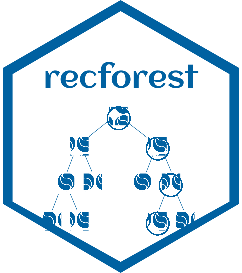
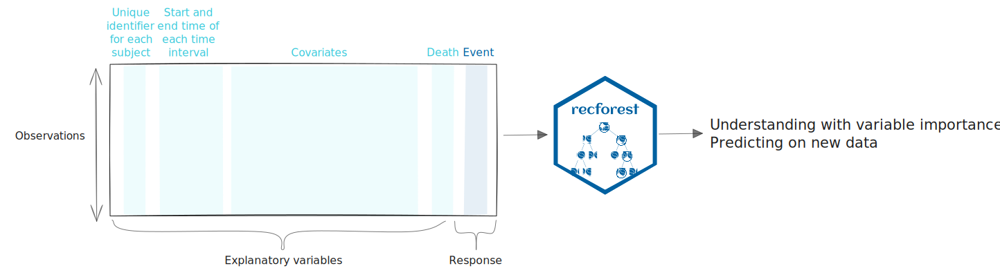
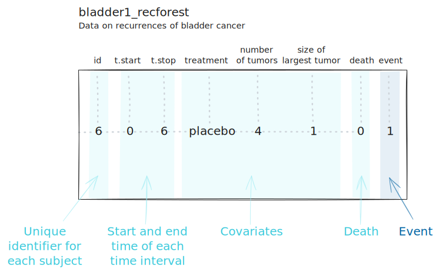

<!-- README.md is generated from README.Rmd. Please edit that file -->

# recforest 

<!-- badges: start -->
<!-- badges: end -->

`{recforest}` offers a flexible solution for analyzing recurrent events
in survival data, outperforming traditional methods like the Cox model,
which struggle with repeated events (e.g., hospital readmissions) and
terminal events like death. By leveraging machine learning (Random
Survival Forests), RecForest models both the timing and frequency of
events, even with right-censored data, leading to more accurate
predictions and insights, ultimately aiding in better decision-making
and patient care.

The methodology is fully described in [Murris, J., Bouaziz, O.,
Jakubczak, M., Katsahian, S., & Lavenu, A.
(2024)](https://hal.science/hal-04612431v1/document).

## Overview



## Installation

You can install the development version of `{recforest}` like so:

**TODO : TO BE COMPLETED ONCE THE PACKAGE IS ON GITHUB / CRAN**

``` r
# Install from CRAN:
install.packages("recforest")

# Or the development version from GitHub:
# install.packages("pak")
pak::pak("XXXX/recforest")
```

## Usage

A example dataset is provided with the package. It is a modified version
of the bladder1 dataset, studying bladder cancer recurrences, from the
`{survival}` package, adapted to be usable with `{recforest}`. Please
use `?survival::bladder` and `?bladder1_recforest` to get more
information about the dataset.



``` r
library(recforest)
data("bladder1_recforest")
head(bladder1_recforest)
#> # A tibble: 6 × 8
#>      id t.start t.stop treatment number  size death event
#>   <int>   <int>  <int> <fct>      <int> <int> <dbl> <dbl>
#> 1     1       0      0 placebo        1     1     0     0
#> 2     2       0      1 placebo        1     3     0     0
#> 3     3       0      4 placebo        2     1     0     0
#> 4     4       0      7 placebo        1     1     0     0
#> 5     5       0     10 placebo        5     1     0     0
#> 6     6       0      6 placebo        4     1     0     1
```

### Train the model

``` r
trained_forest <- train_forest(
  data = bladder1_recforest,
  id_var = "id",
  covariates = c("treatment", "number", "size"),
  time_vars = c("t.start", "t.stop"),
  death_var = "death",
  event = "event",
  n_trees = 5,
  n_bootstrap = 70,
  mtry = 2,
  minsplit = 3,
  nodesize = 15,
  method = "NAa",
  min_score = 5,
  max_nodes = 20,
  seed = 111,
  parallel = FALSE,
  verbose = FALSE
)
```

A full explanation of the data-related and model-related parameters is
provided in the vignette (see [Further details](#further-details)).

#### Using parallel computing

The implementation of parallel computing in this package is based on the
`{future}` and `{future.apply}` packages. To enable parallel processing,
the `parallel` parameter must be set to `TRUE`. The number of cores to
use can be specified by adjusting the `workers` parameter in the
`future::plan()` function, which configures the parallelization
strategy. Two commonly used strategies are:

- **Multicore**: Recommended for UNIX systems, this strategy uses
  multiple distinct processes on the available cores. Example of
  implementation:

  ``` r
  future::plan(future::multicore, workers = n_cores - 1)
  ```

- **Multisession**: Suitable for Windows systems or for more isolated
  executions, it launches multiple R sessions. Example of
  implementation:

  ``` r
  future::plan(future::multisession, workers = n_cores - 1)
  ```

In both cases, the number of cores (`n_cores`) should be defined by the
user based on the available resources.

The following can be run before training the model:

``` r
# Define the strategy and number of cores
n_cores <- min(future::availableCores(), n_trees)
future::plan(future::multisession, workers = n_cores - 1)
```

If you wish to use parallel computing, please refer to the `{future}`
[package documentation](https://future.futureverse.org/) for more
information.

### Analyzing results

``` r
print(trained_forest)
#>
#> ── Tree 1 ──
#>
#> ℹ Number of nodes : 5
#> ℹ c_index : 0.7490882567469
#> ℹ mse_imse : 316.52338769398
#> ℹ mse_iscore : -23.8459208072833
#>
#> ── Tree 2 ──
#>
#> ℹ Number of nodes : 7
#> ℹ c_index : 0.749320446994866
#> ℹ mse_imse : 317.020277729943
#> ℹ mse_iscore : -24.3379911330769
#>
#> ── Tree 3 ──
#>
#> ℹ Number of nodes : 9
#> ℹ c_index : 0.725611597704621
#> ℹ mse_imse : 552.713717581106
#> ℹ mse_iscore : -260.02620872387
#>
#> ── Tree 4 ──
#>
#> ℹ Number of nodes : 5
#> ℹ c_index : 0.757197981596913
#> ℹ mse_imse : 391.055121586804
#> ℹ mse_iscore : -98.20144371709
#>
#> ── Tree 5 ──
#>
#> ℹ Number of nodes : 7
#> ℹ c_index : 0.75103734439834
#> ℹ mse_imse : 419.451806839106
#> ℹ mse_iscore : -126.772535366445
```

``` r
summary(trained_forest)
#>
#> ── Data summary ────────────────────────────────────────────────────────────────
#> ℹ Number of individuals : 118
#> ℹ Number of predictors : 3
#>
#> ── Model parameters ────────────────────────────────────────────────────────────
#> ℹ mtry : 2
#> ℹ minsplit : 3
#> ℹ nodesize : 15
#> ℹ method : NAa
#> ℹ min_score : 5
#> ℹ max_nodes : 20
#>
#> ── Metrics ─────────────────────────────────────────────────────────────────────
#> ℹ c_index : 0.746451125488328
#> ℹ mse_imse : 399.352862286188
#> ℹ mse_iscore : -106.636819949553
#> ℹ computation time (seconds) : 4.4
```

### Prediction

The model can be used to predict an expected mean cumulative number of
recurrent events per individual at the end of follow-up.

``` r
predictions <- predict(
  trained_forest,
  newdata = bladder1_recforest,
  id_var = "id",
  covariates = c("treatment", "number", "size"),
  time_vars = c("t.start", "t.stop"),
  death_var = "death"
)
```

## Further details

A deeper explanation of the methodology and the features of the package can be found in the Vignettes.

The Vignettes are structured as follows:

- **How I can predict events on a new dataset?**
- **How can I get more details about the methodology?**: A detailed explanation of the methodology used in the package.
- **How can I assess the influence of explanatory variables on the event?** (To be expected soon).